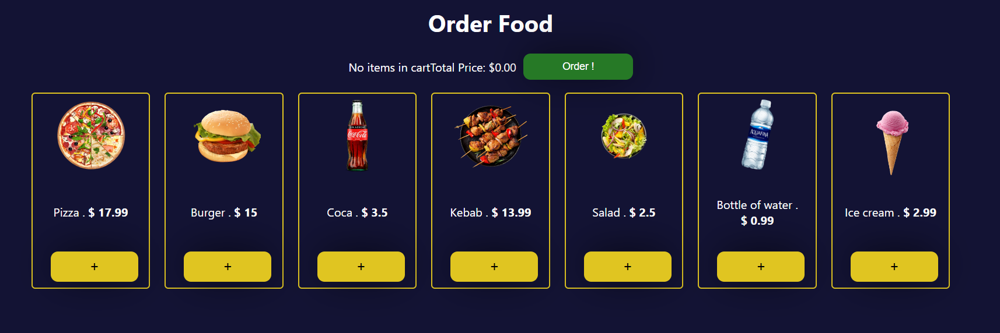
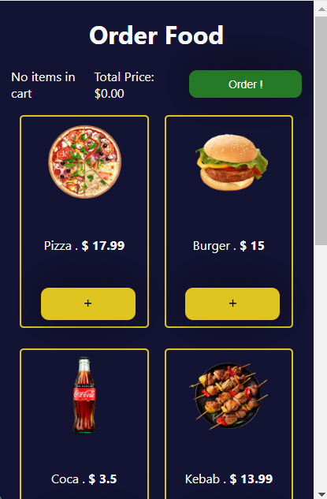
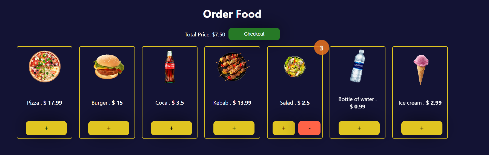

# Food and Beverage Ordering MiniApp on Telegram

## Overview

Welcome to our Food and Beverage Ordering MiniApp built on Telegram Web! This project aims to provide users with a convenient way to browse, order, and enjoy delicious food and beverages through the Telegram platform. With a user-friendly interface and engaging features, our MiniApp makes the ordering process a delightful experience.



## Features

### 1. Menu Exploration

Explore a diverse menu with an array of mouthwatering food and beverage options. The intuitive design allows users to easily navigate through categories and discover their favorite items.



### 2. Seamless Ordering

Place orders effortlessly with a few simple taps. Customize your selections, add items to the cart, and proceed to checkout seamlessly. The ordering process is designed for efficiency and user satisfaction.



### 3. Real-time Updates

Receive real-time updates on your order status. Stay informed about the preparation, packaging, and delivery stages. Track your order with ease and anticipate its arrival.


### 4. User Profiles

Create and manage your user profile. Save your favorite orders, delivery addresses, and payment methods for a quicker and more personalized ordering experience.


## Getting Started

To experience the Food and Beverage Ordering MiniApp:

1. Open your Telegram app or visit the Telegram Web platform.

2. Search for the "FoodOrderBot" or access the MiniApp through a provided link.

3. Begin exploring the menu, placing orders, and enjoying the convenience of food and beverage delivery.

## Technologies Used

- **Telegram Web API**: Leveraging Telegram's capabilities to create a seamless and interactive ordering experience.
  
- **Node.js + ReactJs and Express**: Powering the backend server to handle user requests, process orders, and manage the overall functionality.

- **MongoDB**: Storing user profiles, order history, and other essential data.

## Installation

To set up the project locally, follow these steps:

1. Clone the repository:

   ```bash
   git clone https://github.com/CodeScallop/tele-miniapp-example.git
